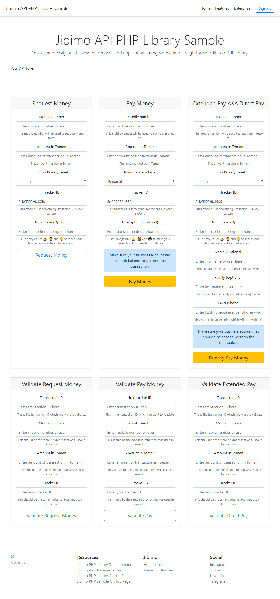

= 🏢 Jibimo PHP Library Sample
Hesam Gholami <hesamgholami@yahoo.com>
v1.0, 2019-06-16

++++
<link rel="stylesheet"  href="http://cdnjs.cloudflare.com/ajax/libs/font-awesome/3.1.0/css/font-awesome.min.css">
++++
:icons: font
:experimental: true

Welcome to Sample of PHP library of Jibimo API, This sample will show you how to use Jibimo PHP Library.

image:https://img.shields.io/github/release/j-tag/jibimo-php-lib-sample.svg[GitHub release]

== 🎁 Quick Start

Simply install the composer dependencies and open up the `index.php` page in your browser.

=== 🎩 Installation

Simply install required packages using following composer command:

[source, bash]
----
composer install
----

This will pull out Jibimo PHP library and this sample can use that.

=== 💵 Using Sample

Using this sample is straightforward. you can simple obtain your token from Jibimo and place it on the token area in this sample app then fill in any form that you want to test, and then pressing the button below it.

Below you can see the screen shot of this sample:

== 💝 Contributing

If you enjoyed this project, please consider contributing to it and make it better.

And please don’t forget to give a star to this project.

Thank you and happy coding!